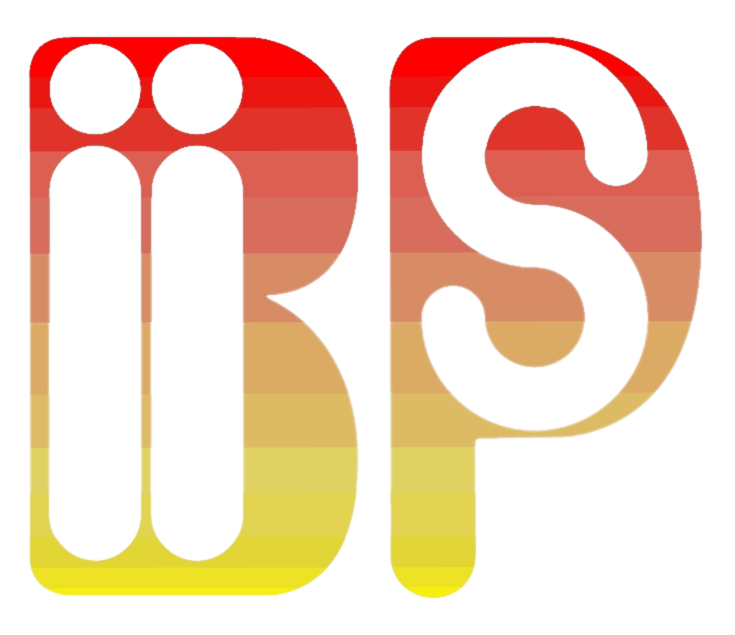

<figure>

<figcaption style="text-align:right;"><i>Logo design: <a href="http://rubis3.blogspot.fr/">Timothée Del Moral</a></i></figcaption>
</figure>

# What is Biips?

**Biips** is a general software for **Bayesian inference with interacting particle systems**, a.k.a. sequential Monte Carlo (SMC) methods. It aims at popularizing the use of these methods to non-statistician researchers and students, thanks to its automated “black box” inference engine.

It borrows from the [BUGS](http://www.mrc-bsu.cam.ac.uk/bugs/)/[JAGS](http://mcmc-jags.sourceforge.net/) software, widely used in Bayesian statistics, the statistical modeling with graphical models and the language associated with their descriptions.

# Features

- BUGS language compiler adapted from JAGS
- SMC techniques for filtering and smoothing
- Static parameter estimation using particle MCMC
- Core developped in C++
- R, Matlab/Octave interfaces
- Easy language extensions with custom R and Matlab functions
- Multi-platform: Linux, Windows, Mac
- Free and open source (GPL)

**[<i class="fa fa-download" aria-hidden="true"></i> Download](/download/)** the latest version
